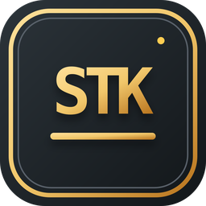
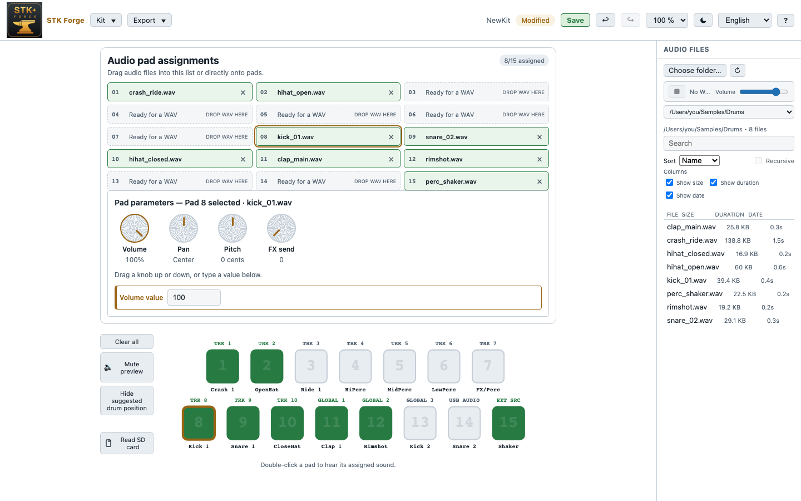
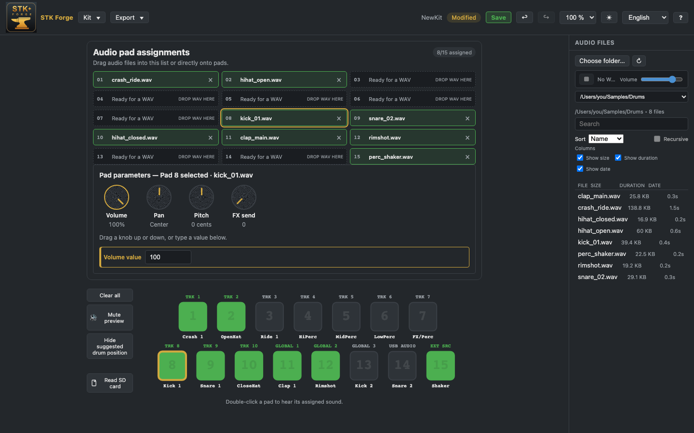

# STK Forge

> A local desktop editor for Sonicware `.stk` kits. **Actively tested with Sonicware SmplTrek firmware 3.2.**

<p align="center">
  
</p>
STK Forge creates editable JSON companions, compiles `.stk` kits, inspects compiled kits without changing the original file, and exports a SmplTrek SD-card layout. It runs locally: no cloud account, telemetry, or upload is required.

  


## What it does

- Create kits with up to 15 WAV assignments for the SmplTrek profile.
- Preview WAVs from the Audio Explorer or an assigned pad with one shared volume control and a persistent mute toggle.
- Switch between persistent light and dark application themes.
- Use the complete interface and bundled help in English, French, or Japanese.
- Save a portable, editable JSON companion file; original WAV files are never altered.
- Compile a SmplTrek-targeted `.stk` file.
- Open a compiled `.stk` file read-only, inspect its structure, and extract an editable kit package with provenance.
- Export either device files only or a complete editable package for a SmplTrek SD card.
- Inspect a selected SmplTrek SD-card directory locally and read-only to list projects, presets, and WAV files.
- Find and relink missing WAV files after a project folder moves.



*Shown in the light theme. The same screen in the dark theme is at the [end of this page](#dark-theme) — STK Forge remembers whichever you pick.*

## Download and install

Ready-to-use builds are published on the **[Releases page](https://github.com/gaumondp/stk-forge/releases)** of this repository. You do not need any developer tools to install them.

| Your computer | Download this file |
| --- | --- |
| **Mac** (Apple Silicon or Intel) | the `.dmg` file |
| **Windows 10 or 11** | the `.exe` installer |

> **These are beta builds.** They work, but they are early: verify every kit you compile on your own SmplTrek before relying on it. If the Releases page has no files yet, the first version has not been tagged — until then you can [build the app from source](#build-from-source).

### First launch on a Mac

STK Forge is **not signed with an Apple certificate**, so macOS will refuse to open it the first time and say it cannot verify the developer. This is expected, and it is a statement about the certificate, not about the app. Here is how to allow it:

1. Open the `.dmg` and drag **STK Forge** into your **Applications** folder.
2. Double-click **STK Forge**. macOS blocks it and shows a warning — click **Done**.
3. Open the **Apple menu → System Settings → Privacy & Security**, and scroll down to **Security**.
4. Click **Open Anyway** next to the message about STK Forge, then enter your password.

That button only appears for about an hour after step 2, so if you miss it, simply double-click the app again to make it reappear. You only do this once: afterwards STK Forge opens normally like any other app.

### First launch on Windows

For the same reason, Windows SmartScreen shows a blue **“Windows protected your PC”** screen. Click **More info**, then **Run anyway**. Again, this is a one-time step.

### Why the warnings

Removing them requires paid code-signing certificates from Apple and a Windows certificate authority. STK Forge is a free, independent beta project and does not have them yet. If you would rather not bypass the warnings, you can [build the app yourself from source](#build-from-source) instead — a build you compile on your own machine is not blocked.

## Quick start

1. Select **New kit** from **Kit**.
2. Choose an audio folder and drag WAV files to pads 1–15.
3. Use **Kit → Kit information…** to name the kit and add notes.
4. Save the editable JSON companion with **Kit → Save**.
5. Choose **Export → Compile to .stk…** to create a SmplTrek-targeted compiled kit.
6. Choose **Export → Export to SD card…** for a SmplTrek card layout.

To inspect an existing compiled file, choose **Open compiled kit…** on the welcome screen or **Kit → Open compiled kit…**. Inspection is read-only; extraction writes new WAV files, an editable JSON companion, and a provenance manifest to the destination you choose.

## Sound assignment

**Full drag-and-drop support**

Drag a WAV from the Audio Explorer to a physical pad or its assignment row. Drag an already assigned sound from either its green physical pad or assignment row to another pad or row. Dropping on an empty target moves the assignment; dropping on an occupied target swaps the two complete assignments.

## Suggested pad positions

The pad facade shows suggested drum positions beneath the physical pads. Use **Hide suggested positions** to turn them off, then **Show suggested positions** to restore them.

| Pad | Suggested position |
| --- | --- |
| 1 | Main crash / Crash 1 |
| 2 | Main open hi-hat / Open HH |
| 3 | Main ride / Ride 1 |
| 4 | High percussion / High perc |
| 5 | Mid percussion / Mid perc |
| 6 | Low percussion / Low perc |
| 7 | Sound effect or special percussion / FX-Perc |
| 8 | Main kick / Kick 1 |
| 9 | Main snare / Snare 1 |
| 10 | Main closed hi-hat / Closed HH |
| 11 | Main clap / Clap 1 |
| 12 | Main rimshot / Rimshot |
| 13 | Secondary kick / Kick 2 |
| 14 | Secondary snare / Snare 2 |
| 15 | Main shaker / Shaker |

## Compatibility

| Product | Status in STK Forge | What is known |
| --- | --- | --- |
| **Sonicware SmplTrek, firmware 3.2** | **Actively tested** | The current compile and SD-export profile targets this device and firmware. |
| **Sonicware ELZ_1 Play** | **Unverified** | Sonicware documents an STK DRUMMER engine and “STK data created with SmplTrek.” STK Forge has not validated this workflow on hardware. |
| **Original ELZ_1, LIVEN, Lofi-12, and other products** | **Unsupported** | No evidence of STK support was found in the source material reviewed. |

The STK format is not presented here as a general Sonicware interchange format. The implementation is based on reverse-engineered SmplTrek kit behavior and can be firmware-sensitive. Do not assume a generated file is safe for an untested product or firmware.

The implementation is based on reverse-engineered SmplTrek kit behavior; the exact claim boundaries are as stated in the table above. The evidence behind each tier — what was verified and how, which Sonicware claims remain unvalidated, and what test would resolve each open question — is documented in [`docs/research/2026-08-28-STK-Sonicware-compatibility.md`](docs/research/2026-08-28-STK-Sonicware-compatibility.md).


## Data and safety boundaries

- JSON uses the stable `smpltrek-kit-project` schema. This is intentionally not renamed, so existing editable projects remain compatible.
- The current device profile is structurally specific to **SmplTrek firmware 3.2**.
- Compiling and exporting never overwrite an input `.stk` or WAV file. Overwrite prompts apply only to a selected output destination.
- A successful compile is not proof of compatibility with untested firmware or hardware. Test on non-critical media before relying on a kit.

## Attribution

STK Forge was inspired by [jblamber/stk_writer](https://github.com/jblamber/stk_writer). Warm thanks to jblamber for publishing the reverse-engineering work that informed our understanding of the STK format and made this editor possible. This project references that work for research and attribution; it does not copy its code.

## License and disclaimer

MIT. STK Forge is an independent project and is not affiliated with, endorsed by, or supported by Sonicware. Use it at your own risk and verify every output on the exact hardware and firmware you intend to use.


## Technical section

### Build from source

Requirements: Node.js 20+, pnpm 9+, Rust stable, and the platform build tools for Tauri.

```bash
pnpm install

# Verification gates (the same ones CI runs)
pnpm check
pnpm format:check
pnpm test
pnpm test:rust
pnpm test:e2e

# Development
pnpm tauri:dev

# Installable bundles for the current platform
# macOS: .app + .dmg   ·   Windows: .exe installer
pnpm tauri build

# macOS app bundle only, without the disk image
pnpm tauri build --bundles app
```

The Rust crate, the Windows executable name and the JSON schema name intentionally keep the legacy `smpltrek-kit-builder` / `smpltrek-kit-project` identifiers for backward compatibility, while the product is STK Forge.

Every push runs these gates on Linux and verifies that macOS and Windows still build, via [`.github/workflows/ci.yml`](.github/workflows/ci.yml). Pushing a `v*` tag builds and attaches the downloadable binaries to a draft release, via [`.github/workflows/release.yml`](.github/workflows/release.yml).

### WAV input and preview

STK Forge reads RIFF/WAVE files with PCM samples at 8-, 16-, 24-, or 32-bit depth, plus IEEE floating-point samples at 32- or 64-bit depth. The parser accepts standard `fmt ` and `data` chunks and safely ignores unrelated RIFF chunks such as `LIST`, `cue`, and `fact`.

The Audio Explorer and assigned pads use one local preview player, with a shared volume slider and mute state. Source files remain unchanged. During compilation, supported source audio is normalized to the SmplTrek target format: 48 kHz, 16-bit linear PCM, mono or stereo according to the selected compile option.

### The current STK implementation

An `.stk` file is a compiled binary kit container, not a documented general-purpose interchange format. The current implementation targets the SmplTrek firmware 3.2 profile. It writes and validates the known `VDK0PR\0` header, a `KTDT` pad-metadata block, and embedded RIFF/WAV audio. The active profile supports up to 15 sample pads; its audio pipeline normalizes source material for the SmplTrek target (48 kHz, 16-bit PCM WAV).

These details come from reverse-engineering observed SmplTrek kit behavior. Some container bytes remain of unknown purpose, and Sonicware may change device behavior in future firmware. A structurally valid file is therefore not a compatibility guarantee for another device or firmware. The evidential basis for these limits — verified facts, unvalidated vendor claims, and the open questions that remain — is recorded in [`docs/research/2026-08-28-STK-Sonicware-compatibility.md`](docs/research/2026-08-28-STK-Sonicware-compatibility.md).

The field-level container reference is available in [`docs/file_format.md`](docs/file_format.md), with its original source and attribution.

### Why editable JSON stays separate

The hardware does not read the JSON file. STK Forge uses a separate JSON companion because the compiled container is an export artifact: it does not reliably preserve the source WAV locations, the user’s kit notes, or every editor-level choice needed for a safe round trip. Keeping the editable data separate also means inspection and extraction never modify an input `.stk` file.

The JSON schema is intentionally still named `smpltrek-kit-project` for backward compatibility with existing editable projects. It records the current device profile, kit parameters, sample references, and notes; STK Forge can then recompile a new `.stk` output at a location chosen by the user. This separation is temporary only in the sense that the format and profiles may evolve: it is currently the safer and more recoverable editing model.

## Dark theme



*The same kit in the dark theme. Switch themes from the sun and moon button in the header; the choice persists between sessions, as do the interface language and the display scale.*
